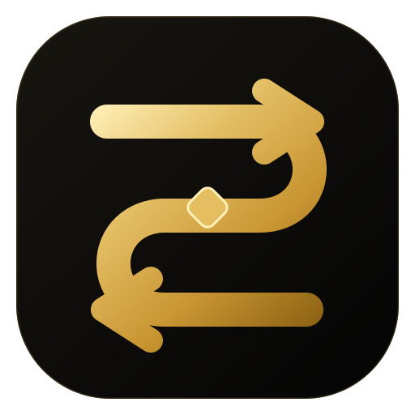
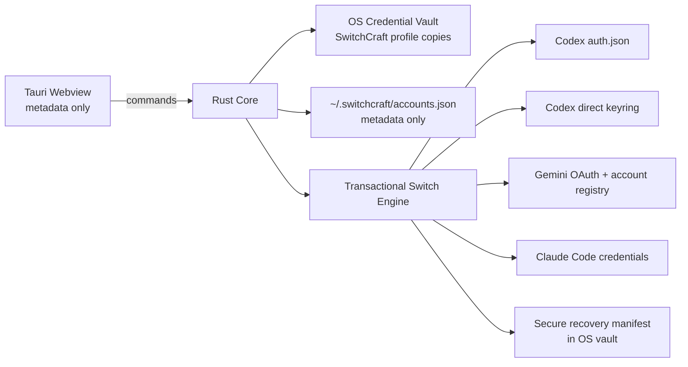

<div align="center">



# SwitchCraft

**Secure local session control for AI developer tools**

<p align="center">
  
  
  
  
</p>

SwitchCraft keeps multiple authenticated AI developer profiles available locally and applies a selected session to supported clients without exposing stored credentials to the webview UI.

</div>

---

## What changed in v1.2

v1.2 builds on the secure session-first architecture introduced during the v1.1 development cycle and adds config-aware Codex credential-store support.

- Codex file-backed ChatGPT OAuth sessions remain supported.
- Codex **direct OS keyring** sessions are supported using the same public storage contract as Codex: service `Codex Auth` and an account key derived from canonical `CODEX_HOME`.
- `cli_auth_credentials_store = "auto"` follows Codex's keyring-first behavior when the direct backend is available and falls back to the auth file when keyring access is unavailable.
- Codex `SecretAuthStorage` is detected and deliberately rejected until SwitchCraft implements the encrypted `codex_auth.age` backend completely.
- File and keyring mutations now share one transactional recovery model with rollback.
- Existing v1.1 file recovery snapshots remain readable.
- Known managed Codex auth-storage policy is detected so SwitchCraft does not silently switch a backend that Codex will ignore.
- Release metadata is synchronized across npm, Cargo and Tauri, with CI checks preventing mismatched tags or stale lockfiles.
- Desktop window behavior is tray-first on Windows, macOS and Linux. macOS places the custom close/minimize controls on the left; Windows and Linux keep them on the right.
- The tray menu exposes Open SwitchCraft, Switch account, Check for Updates and Quit. Windows/macOS support richer tray click behavior; Linux AppIndicator environments use the context menu because Tauri does not expose Linux tray click events.
- Autostart launches SwitchCraft with `--hidden` so the app can start without opening its main window.

Because v1.1 was never published as a public GitHub release, v1.2 also includes the v1.1 foundation: native SwitchCraft vault storage, migration away from plaintext profile secrets, atomic file replacement, Quick Switch, redesigned black-and-gold UI, updater signing and package-smoke CI.

---

## Security model

SwitchCraft is local-first. It does not provide a hosted credential service and does not send stored provider sessions to a SwitchCraft backend.



### Secret storage

SwitchCraft uses the Rust `keyring` crate for protected profile copies and recovery state:

- **Windows:** Windows Credential Manager native backend.
- **macOS:** Keychain native backend.
- **Linux:** Secret Service backend.

`~/.switchcraft/accounts.json` stores metadata such as profile ID, display name, provider, email, active state and usage display data. Managed credentials are not serialized into that file.

Codex's own credential store is a separate target. When Codex is explicitly using its **direct keyring** backend, SwitchCraft reads or writes the `Codex Auth` entry that corresponds to the active `CODEX_HOME`. This should not be confused with Codex `SecretAuthStorage`, which uses an encrypted secrets backend and is not yet modified by SwitchCraft.

### Transactional switching

Before modifying a supported client session, SwitchCraft:

1. Resolves the effective supported target.
2. Captures the current file/keyring state.
3. Applies the requested file and/or keyring mutations.
4. Stores a secure recovery manifest.
5. Persists SwitchCraft account metadata only after target mutation succeeds.
6. Rolls target state back if a later mutation or metadata persistence fails.
7. Keeps a reverse recovery point when restoring the previous session.

File writes use temporary files plus flush/sync and atomic persistence. The Settings page exposes **Restore previous session** for supported providers.

---

## Current compatibility

Compatibility is defined by **client + authentication mechanism**, not only by vendor account.

| Provider | Client / target | Status in v1.2 | Notes |
| --- | --- | --- | --- |
| OpenAI | Codex file-backed ChatGPT OAuth | **Supported** | `$CODEX_HOME/auth.json` or `~/.codex/auth.json`. |
| OpenAI | Codex direct OS keyring | **Supported** | Uses public Codex `Codex Auth` direct-keyring contract when `secret_auth_storage = false`. |
| OpenAI | Codex `auto` with direct keyring | **Supported** | Keyring-first behavior with file fallback when direct-keyring access is unavailable. |
| OpenAI | Codex `SecretAuthStorage` | **Detected / not switched** | Current Codex builds may use encrypted `secrets/codex_auth.age`; SwitchCraft refuses to modify the wrong backend. |
| Google | Gemini CLI OAuth | **Supported** | Switches `~/.gemini/oauth_creds.json` together with `~/.gemini/google_accounts.json`. |
| Anthropic | Claude Code file-backed credentials | **Supported** | `$CLAUDE_CONFIG_DIR/.credentials.json` or `~/.claude/.credentials.json`. |
| Anthropic | Claude Code macOS Keychain | **Next / research** | Requires a provider-specific Keychain adapter. |
| Google | Antigravity desktop / IDE | **Research** | No stable switching path is advertised from undocumented private credential-store keys. |
| OpenAI | ChatGPT desktop application | **Research** | Not assumed to share Codex's local credential contract. |
| Anthropic | Claude Desktop | **Research** | Kept separate from Claude Code until a stable credential contract is verified. |

If SwitchCraft cannot identify where the effective session lives and how the client expects it to be updated, the integration fails explicitly rather than writing speculative credentials.

### Managed Codex configuration

Codex can receive authentication requirements from managed configuration layers. SwitchCraft checks known local managed inputs such as `managed_config.toml` and `requirements.toml` for auth-storage policy. When such a policy is detected, v1.2 stops with an explicit message instead of assuming the user's `config.toml` is the effective policy.

---

## Account onboarding

The recommended flow is **Active session**:

1. Sign in using a supported provider developer client.
2. Open SwitchCraft and choose **Add account**.
3. Select OpenAI, Google or Anthropic.
4. Give the profile a local label such as `Personal`, `Work` or `School`.
5. Choose **Import active session**.
6. SwitchCraft reads the supported local session in Rust and stores its protected profile copy in the OS credential vault.

For Codex, import respects the configured credential-store mode. Ephemeral process-memory authentication cannot be imported safely and is rejected.

A **Raw JSON · Advanced** importer remains available for controlled migrations. It is not the default authentication flow and does not turn arbitrary API keys into OAuth sessions.

---

## Usage display

SwitchCraft currently stores usage snapshots locally; it does not scrape private provider endpoints.

The UI represents **remaining capacity**:

- **60–100% remaining:** green
- **30–59% remaining:** amber
- **0–29% remaining:** red

Codex-style profiles expose **5 hours remaining** and **Weekly remaining**. Automated usage adapters should be added only when a sufficiently stable source exists.

---

## Quick Switch

Use:

- **Windows / Linux:** `Ctrl + K`
- **macOS:** `Cmd + K`

Search by profile name, email or provider, move with the arrow keys and press Enter to switch. The tray menu uses the same Rust transaction engine. On Windows and macOS the tray supports direct click interactions; on Linux, AppIndicator environments expose the menu through the desktop environment's context-menu gesture.

---

## Local files and credential targets

SwitchCraft metadata:

```text
~/.switchcraft/accounts.json
```

Provider targets currently include:

```text
Codex file mode
  $CODEX_HOME/auth.json
  or ~/.codex/auth.json

Codex direct keyring
  service: Codex Auth
  account: cli|{first 16 hex chars of SHA-256(canonical CODEX_HOME)}

Gemini CLI
  ~/.gemini/oauth_creds.json
  ~/.gemini/google_accounts.json

Claude Code file-backed
  $CLAUDE_CONFIG_DIR/.credentials.json
  or ~/.claude/.credentials.json
```

SwitchCraft profile copies and recovery manifests remain in the host OS credential vault.

---

## Build from source

### Requirements

- Node.js 20+
- Rust stable
- Tauri 2 system dependencies for the target operating system
- Linux: WebKitGTK/AppIndicator plus D-Bus development packages for Secret Service support

```bash
git clone https://github.com/dannymaaz/SwitchCraft.git
cd SwitchCraft
npm ci
npm run dev
```

Production build:

```bash
npm run build
```

Useful validation commands:

```bash
npm run version:check
npm run fmt:check
node --check src/app.js
cargo check --locked --manifest-path src-tauri/Cargo.toml
cargo test --locked --manifest-path src-tauri/Cargo.toml
```

---

## Release pipeline

Pull requests run Quality and Package Smoke on Windows, macOS and Linux. Quality also runs after merges to `main`.

Before packaging, CI verifies that these version sources agree:

- `package.json`
- `package-lock.json`
- `src-tauri/tauri.conf.json`
- `src-tauri/Cargo.toml`
- `src-tauri/Cargo.lock`

For a tagged release, the tag itself must match the synchronized project version. Release builds are uploaded to a **draft** GitHub release first; the release is made public only after all three platform build jobs succeed.

The updater is supported on all three desktop platforms: Windows uses the NSIS updater package, macOS uses the signed `.app.tar.gz` updater artifact, and Linux uses the signed AppImage updater artifact. macOS and Linux relaunch the application after installation; Windows hands off to the NSIS installer, which exits/restarts the app as part of the updater flow.

Tauri updater artifacts are cryptographically signed. Updater signing is not the same as native publisher signing: Windows Authenticode and Apple Developer ID/notarization still require their respective platform credentials.

---

## Design system

SwitchCraft uses:

- near-black application surfaces;
- controlled gold for brand, selection and active identity;
- green / amber / red only for operational state and remaining usage;
- explicit actions for credential-changing operations;
- one master SVG mark used to generate package icons and installer assets.

Master assets:

```text
src/logo.svg
assets/logo.svg
```

---

## Roadmap

High-priority next work:

1. Codex `SecretAuthStorage` adapter for the encrypted auth backend, with particular importance on Windows.
2. Claude Code macOS Keychain adapter.
3. Stable Antigravity target discovery without relying on undocumented account-token keys.
4. Provider-backed usage adapters where stable quota sources exist.
5. Installed-target detection and clearer per-profile compatibility reporting.
6. Multi-target presets for coherent work/personal identity switching.
7. Windows Authenticode signing and Apple Developer ID/notarization.
8. Expanded migration, rollback and real-client integration tests.
9. Repository rules/branch protection requiring release gates before merge.

---

## Privacy

SwitchCraft does not bundle analytics or advertising telemetry. Provider credentials are intended to remain on the host machine. Raw exported credential JSON is sensitive and should not be shared in issues, screenshots or logs.

## License

MIT. See [LICENSE](LICENSE).

---

<div align="center">
  <sub>Designed and built by <strong>Danny Maaz</strong></sub>
</div>