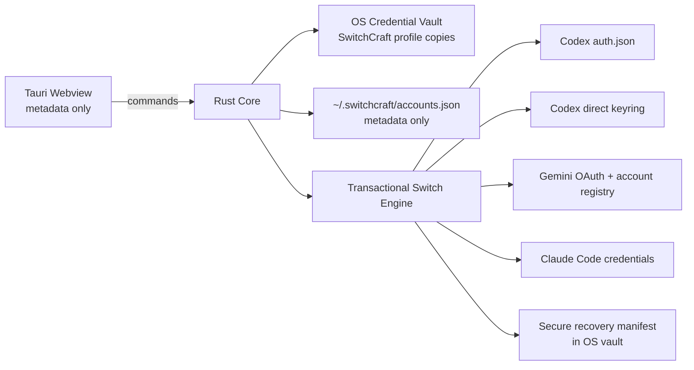

# SwitchCraft

**Secure local session control for AI developer tools**

  
  
  
  

SwitchCraft keeps multiple authenticated AI developer profiles available locally and applies a selected session to supported clients without exposing stored credentials to the webview UI.

---

## What changed in v1.2

v1.2 builds on the secure session-first architecture introduced during the v1.1 development cycle and adds config-aware Codex credential-store support.

- Codex file-backed ChatGPT OAuth sessions remain supported.
- Codex **direct OS keyring** sessions are supported using the same public storage contract as Codex: service `Codex Auth` and an account key derived from canonical `CODEX_HOME`.
- `cli_auth_credentials_store = "auto"` follows Codex's keyring-first behavior when the direct backend is available and falls back to the auth file when keyring access is unavailable.
- Codex `SecretAuthStorage` is detected and deliberately rejected until SwitchCraft implements the encrypted `codex_auth.age` backend completely.
- File and keyring mutations now share one transactional recovery model with rollback.
- Existing v1.1 file recovery snapshots remain readable.
- Known managed Codex auth-storage policy is detected so SwitchCraft does not silently switch a backend that Codex will ignore.
- Release metadata is synchronized across npm, Cargo and Tauri, with CI checks preventing mismatched tags or stale lockfiles.
- Desktop window behavior is tray-first on Windows, macOS and Linux. macOS uses left-side custom close/minimize controls; Windows and Linux keep them on the right.
- The tray menu exposes Open SwitchCraft, Switch account, Check for Updates and Quit. Windows/macOS support the richer tray click behavior; Linux AppIndicator environments use the context menu because Tauri does not expose Linux tray click events.
- Autostart launches SwitchCraft with `--hidden` so the app can start without opening its main window.

Because v1.1 was never published as a public GitHub release, v1.2 also includes the v1.1 foundation: native SwitchCraft vault storage, migration away from plaintext profile secrets, atomic file replacement, Quick Switch, redesigned black-and-gold UI, updater signing and package-smoke CI.

---

## Security model

SwitchCraft is local-first. It does not provide a hosted credential service and does not send stored provider sessions to a SwitchCraft backend.

### Secret storage

SwitchCraft uses the Rust `keyring` crate for protected profile copies and recovery state:

- **Windows:** Windows Credential Manager native backend.
- **macOS:** Keychain native backend.
- **Linux:** Secret Service backend.

`~/.switchcraft/accounts.json` stores metadata such as profile ID, display name, provider, email, active state and usage display data. Managed credentials are not serialized into that file.

Codex's own credential store is a separate target. When Codex is explicitly using its **direct keyring** backend, SwitchCraft reads or writes the `Codex Auth` entry that corresponds to the active `CODEX_HOME`. This should not be confused with Codex `SecretAuthStorage`, which uses an encrypted secrets backend and is not yet modified by SwitchCraft.

### Transactional switching

Before modifying a supported client session, SwitchCraft:

1. Resolves the effective supported target.
2. Captures the current file/keyring state.
3. Applies the requested file and/or keyring mutations.
4. Stores a secure recovery manifest.
5. Persists SwitchCraft account metadata only after target mutation succeeds.
6. Rolls target state back if a later mutation or metadata persistence fails.
7. Keeps a reverse recovery point when restoring the previous session.

File writes use temporary files plus flush/sync and atomic persistence. The Settings page exposes **Restore previous session** for supported providers.
