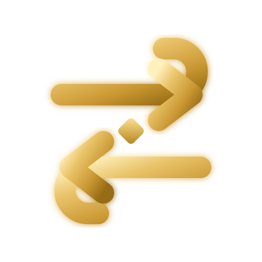
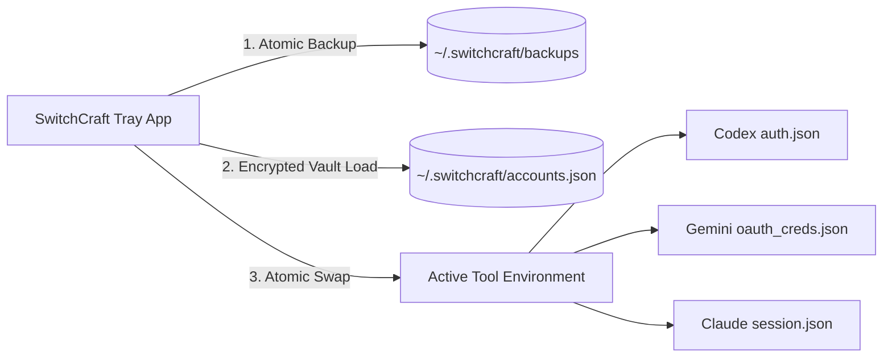

<div align="center">



# SwitchCraft

**Unified, instantaneous account manager for AI developer environments**

<p align="center">
  
  
  
  
</p>

<p align="center">
  Seamlessly swap between multiple profiles across <strong>Codex</strong>, <strong>Gemini / Antigravity</strong>, and <strong>Claude</strong> with a single click. Zero terminal commands. Zero credential collisions.
</p>

</div>

---

## Overview

SwitchCraft is a lightweight, background-resident desktop utility designed to eliminate authentication friction for engineers working with multiple AI accounts and organizations.

Instead of manually clearing cache directories, re-running CLI authentication prompts, or juggling browser profiles, SwitchCraft maintains an isolated, encrypted vault of credentials and performs atomic file swaps at the operating system level.

---

## Platform Support & Target Integrations

<table>
  <thead>
    <tr>
      <th>Platform</th>
      <th>Credential Scope</th>
      <th>Supported Environments</th>
      <th>Target Auth File</th>
    </tr>
  </thead>
  <tbody>
    <tr>
      <td><strong>Codex</strong></td>
      <td>OpenAI OAuth & API Keys</td>
      <td>Codex CLI, IDE Plugins, Desktop</td>
      <td><code>~/.codex/auth.json</code></td>
    </tr>
    <tr>
      <td><strong>Gemini / Antigravity</strong></td>
      <td>Google OAuth & AI Studio Tokens</td>
      <td>Antigravity IDE, Gemini CLI</td>
      <td><code>~/.gemini/oauth_creds.json</code><br/><code>~/.gemini/google_accounts.json</code></td>
    </tr>
    <tr>
      <td><strong>Claude</strong></td>
      <td>Anthropic Session & API Keys</td>
      <td>Claude Desktop, Claude Code</td>
      <td><code>Claude/session.json</code> (AppData / App Support / Config)</td>
    </tr>
  </tbody>
</table>

---

## Architecture & Mechanics

SwitchCraft operates locally on your machine without external dependencies or cloud relays.



1. **Safety Backup**: Prior to any state change, existing credentials in the target path are archived into timestamped backups located at `~/.switchcraft/backups/`.
2. **Atomic Replacement**: The target file is written atomically to ensure zero partial-state corruption.
3. **Session Synchronization**: For multi-file environments (such as Antigravity with Google OAuth and active account registry), both files are updated synchronously.

---

## Installation

### Binary Packages (Direct Download)

Pre-compiled packages for each architecture are available directly from GitHub Releases:

- **Windows (x64)**: [SwitchCraft_1.0.1_x64-setup.exe](https://github.com/dannymaaz/SwitchCraft/releases/latest) | [SwitchCraft_1.0.1_x64_en-US.msi](https://github.com/dannymaaz/SwitchCraft/releases/latest)
- **macOS (Universal / Apple Silicon / Intel)**: [SwitchCraft_1.0.1_aarch64.dmg](https://github.com/dannymaaz/SwitchCraft/releases/latest)
- **Linux (Debian / Ubuntu / AppImage)**: [SwitchCraft_1.0.1_amd64.AppImage](https://github.com/dannymaaz/SwitchCraft/releases/latest) | [SwitchCraft_1.0.1_amd64.deb](https://github.com/dannymaaz/SwitchCraft/releases/latest)

---

### Command Line Installation

#### Linux & macOS

```bash
curl -fsSL https://raw.githubusercontent.com/dannymaaz/SwitchCraft/main/scripts/install.sh | bash
```

#### Windows (PowerShell)

```powershell
irm https://raw.githubusercontent.com/dannymaaz/SwitchCraft/main/scripts/install.ps1 | iex
```

---

## Authentication Methods

SwitchCraft provides three secure onboarding pathways within the profile creation modal:

### 1. Direct Credential Entry
- Masked password input field with visibility toggle for screen-sharing security.
- Accepts raw API keys (`sk-...`, `AIzaSy...`, `sk-ant-...`) or session tokens.
- Automatically generates the compliant JSON schema required by the target platform.

### 2. Browser-Assisted Login Flow
- Click **Open Official Login** to open the official vendor portal in your default browser.
- Authenticate normally with your organization or personal credentials.
- Click **Capture Active Session** to automatically extract and register the session.

### 3. Raw JSON Importer
- Direct import for advanced users migrating existing configuration files.

---

## Usage Quota Monitoring

SwitchCraft allows optional tracking for hourly and weekly allocation limits:

- **Weekly Quotas**: Track cumulative consumption across enterprise and team accounts.
- **Hourly Rate Limits**: Monitor high-frequency API usage limits.
- **Visual Status Bars**: Color-coded cockpit progress indicators with real-time saturation alerts.

---

## Configuration & Autostart

- **Silent Autostart**: Enable launch on system boot via native OS services (LaunchAgent on macOS, Registry Run on Windows, XDG autostart on Linux).
- **Background Tray Mode**: Minimizing or closing the window parks SwitchCraft in the notification area without interrupting active processes.
- **Auto-Update Engine**: Checks GitHub Releases via cryptographic signature verification with fallback to manual verification in settings.

---

## Building from Source

### Prerequisites

- [Rust Toolchain (v1.75+)](https://rustup.rs/)
- [Node.js (v20+)](https://nodejs.org/)

### Build Steps

```bash
# Clone the repository
git clone https://github.com/dannymaaz/SwitchCraft.git
cd SwitchCraft

# Install dependencies
npm install

# Run in development mode
npm run tauri dev

# Build production bundle
npm run tauri build
```

---

## Security & Privacy Policy

- **Zero Cloud Storage**: All profile records remain exclusively on the host device within `~/.switchcraft/`.
- **Local Execution**: No analytics, telemetry, or third-party tracking scripts are bundled.
- **Cryptographic Verification**: Release binaries and auto-update payloads are cryptographically signed using Minisign keys.

---

## License

This project is released under the **MIT License**. See [LICENSE](LICENSE) for full legal text.

---

<div align="center">
  <sub>Designed and built by <strong>Danny Maaz</strong></sub>
</div>
