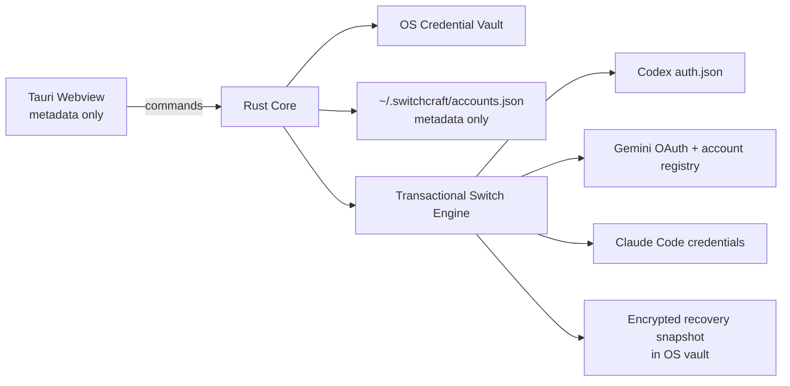

<div align="center">


# SwitchCraft

**Secure local session control for AI developer tools**

<p align="center">
  
  
  
  
</p>

SwitchCraft keeps multiple authenticated AI developer profiles available locally and applies a selected session to supported clients without exposing stored credentials to the webview UI.

</div>

---

## What changed in v1.1

v1.1 replaces the original API-key-oriented prototype with a session-first architecture.

- Credentials managed by SwitchCraft are stored in the operating system credential vault rather than in plaintext `accounts.json`.
- Existing v1.0 plaintext profiles are migrated automatically when the native credential store is available.
- The frontend receives account metadata only; credential material remains in Rust.
- Session replacement uses temporary files, flush/sync and atomic persistence.
- The previous target state is captured in the secure vault before a switch and can be restored.
- Gemini's OAuth file and active-account registry are changed as one transaction.
- Account switching now uses an explicit **Switch** action instead of making the entire card destructive/clickable.
- `Ctrl + K` / `Cmd + K` opens Quick Switch.
- Usage indicators represent **remaining percentage**, not consumed percentage.
- The application has a redesigned black-and-gold interface and a new routing-based SwitchCraft mark.
- Release builds regenerate Windows, macOS and Linux icons from the SVG master with the Tauri CLI.

---

## Security model

SwitchCraft is local-first. It does not provide a hosted credential service and does not send stored provider sessions to a SwitchCraft backend.



### Secret storage

SwitchCraft uses the Rust `keyring` crate to select the native credential service for the host platform:

- **Windows:** Windows Credential Manager native backend.
- **macOS:** Keychain native backend.
- **Linux:** Secret Service backend.

`~/.switchcraft/accounts.json` stores metadata such as profile ID, display name, provider, email, active state and usage display data. New credentials are not serialized into that file.

### Transactional switching

Before modifying a supported client session, SwitchCraft:

1. Resolves the provider target files.
2. Reads the current target state.
3. Stores a recovery snapshot in the OS credential vault.
4. Writes each replacement to a temporary file in the destination directory.
5. Flushes and synchronizes the temporary file.
6. Atomically persists it over the destination.
7. Rolls already-applied targets back if a later target fails.
8. Rolls target files back if SwitchCraft cannot persist its own account state.

The Settings page exposes **Restore previous session** for each supported provider.

---

## Current compatibility

SwitchCraft deliberately reports only integrations it can switch through a known local credential format. It does not claim support merely because two applications share the same vendor account.

| Provider | v1.1 target | Status | Notes |
| --- | --- | --- | --- |
| OpenAI | Codex file-backed ChatGPT OAuth session | Supported | Uses `$CODEX_HOME/auth.json` or `~/.codex/auth.json`. Codex installations configured to keep CLI credentials in the OS keyring require a future native adapter. |
| Google | Gemini CLI OAuth | Supported | Switches `~/.gemini/oauth_creds.json` together with `~/.gemini/google_accounts.json`. |
| Anthropic | Claude Code file-backed credentials | Supported | Uses `$CLAUDE_CONFIG_DIR/.credentials.json` or `~/.claude/.credentials.json`. macOS commonly stores Claude Code credentials in Keychain, which requires a future provider-specific adapter. |
| Google | Antigravity desktop / IDE credential store | Research | Not enabled in v1.1 because SwitchCraft does not depend on undocumented private credential-store keys. |
| OpenAI | ChatGPT desktop application session | Research | Not treated as equivalent to Codex's local auth file unless an official/stable integration is available. |
| Anthropic | Claude Desktop application session | Research | Kept separate from Claude Code until a stable credential contract is available. |

This distinction is intentional: SwitchCraft should fail clearly rather than silently write a credential shape a client may not understand.

---

## Account onboarding

The recommended flow is now **Active session**:

1. Sign in using the provider's supported developer client.
2. Open SwitchCraft and choose **Add account**.
3. Select OpenAI, Google or Anthropic.
4. Give the profile a local label such as `Personal`, `Work` or `School`.
5. Choose **Import active session**.
6. SwitchCraft reads the supported local session file in Rust and stores its protected copy in the OS credential vault.

A **Raw JSON · Advanced** importer remains available for controlled migrations. It is not the default authentication flow and it does not turn arbitrary API keys into OAuth sessions.

---

## Usage display

v1.1 can attach a manual usage snapshot to a profile. The UI is designed around **remaining capacity**:

- **60–100% remaining:** green
- **30–59% remaining:** amber
- **0–29% remaining:** red

For Codex-style profiles the UI provides **5 hours remaining** and **Weekly remaining** fields. Provider usage is not scraped from private endpoints in v1.1. Automated quota adapters should be added only when a sufficiently stable source exists.

---

## Quick Switch

Use:

- **Windows / Linux:** `Ctrl + K`
- **macOS:** `Cmd + K`

Search by profile name, email or provider, move with the arrow keys and press Enter to switch. The same switch operation uses the Rust transactional engine as the main account cards.

---

## Local files

SwitchCraft itself uses:

```text
~/.switchcraft/accounts.json
```

for non-secret metadata. Secret profile copies and recovery snapshots are stored in the host OS credential vault under the SwitchCraft service identifier.

Provider target paths currently include:

```text
Codex
  $CODEX_HOME/auth.json
  or ~/.codex/auth.json

Gemini CLI
  ~/.gemini/oauth_creds.json
  ~/.gemini/google_accounts.json

Claude Code
  $CLAUDE_CONFIG_DIR/.credentials.json
  or ~/.claude/.credentials.json
```

---

## Build from source

### Requirements

- Node.js 20+
- Rust stable
- Tauri 2 system dependencies for the target operating system
- Linux: WebKitGTK/AppIndicator plus D-Bus development packages for Secret Service support

```bash
git clone https://github.com/dannymaaz/SwitchCraft.git
cd SwitchCraft
npm ci
npm run dev
```

Production build:

```bash
npm run build
```

`npm run build` regenerates platform icons from `src/logo.svg` before building the Tauri bundle.

Useful validation commands:

```bash
node --check src/app.js
cargo check --manifest-path src-tauri/Cargo.toml
cargo test --manifest-path src-tauri/Cargo.toml
```

---

## Releases and signing

GitHub Actions builds Windows, macOS and Linux release artifacts and generates Tauri updater signatures.

Updater signing is not the same as native operating-system publisher signing. Windows Authenticode and Apple Developer ID/notarization require external platform credentials and remain separate release-hardening work before broad end-user distribution.

---

## Design system

The v1.1 visual system uses:

- near-black application surfaces;
- controlled gold for brand, selection and active identity;
- green / amber / red only for operational state and remaining usage;
- larger progress bars and typography than v1.0;
- explicit actions for credential-changing operations;
- one master SVG mark used to generate package icons.

Master assets:

```text
src/logo.svg
assets/logo.svg
```

---

## Roadmap

High-priority next work:

1. Native Codex keyring adapter for installations using `cli_auth_credentials_store = "keyring"`.
2. Claude macOS Keychain adapter.
3. Stable Antigravity target discovery without relying on undocumented account tokens.
4. Provider-backed usage adapters where stable usage sources exist.
5. Better target detection so a profile can display exactly which installed clients it can control.
6. Multi-target presets for switching a coherent work/personal identity set.
7. Windows Authenticode signing and Apple notarization.
8. Expanded integration tests for migration, rollback and provider file schemas.

---

## Privacy

SwitchCraft does not bundle analytics or advertising telemetry. Provider credentials are intended to remain on the host machine. Users should still treat exported raw credential JSON as sensitive data and avoid sharing it in issues, screenshots or logs.

## License

MIT. See [LICENSE](LICENSE).

---

<div align="center">
  <sub>Designed and built by <strong>Danny Maaz</strong></sub>
</div>
